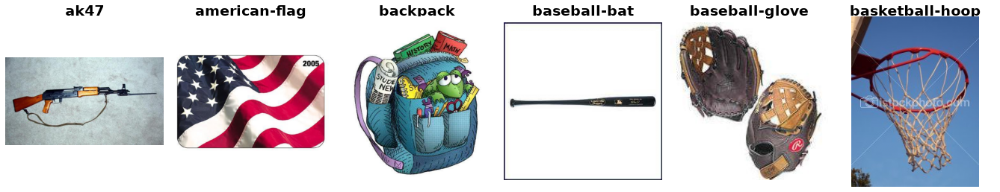

Caltech-256
===========

.. raw:: html

   

   
   
   
   

Overview
--------

The Caltech-256 dataset is a large-scale image classification benchmark for single-label object recognition.
It contains **257 object categories** with **at least 80 images per class**, resulting in **30,607 images** in total.
The dataset contains a wide variety of objects and substantial variation in viewpoint, scale, lighting, and background.
It does not provide an official train/test split, so this is left for the user to customize.

* **Total**: 30,607 images across 257 classes
* **Classes**: 257 object categories

Images have varying resolutions and aspect ratios. The dataset contains 30,185 RGB and 422 grayscale images, however
all images have been converted to 3-channel RGB format.

Data Structure
--------------

When accessing an example using ``ds[i]``, you will receive a dictionary with the following keys:

.. list-table::
   :header-rows: 1
   :widths: 20 20 60

   * - Key
     - Type
     - Description
   * - ``image``
     - ``PIL.Image.Image``
     - RGB image with maximum side length ≤ 7913 pixels
   * - ``label``
     - int
     - Class label in the range ``[0, 256]``

Usage Example
-------------

**Basic Usage**

.. code-block:: python

    from stable_datasets.images.caltech256 import Caltech256

    # Load training split (the only available split)
    ds = Caltech256(split="train")

    sample = ds[0]
    print(sample.keys())  # {"image", "label"}

    # Optional: make it PyTorch-friendly
    ds_torch = ds.with_format("torch")

References
----------

- Official website: https://data.caltech.edu/records/nyy15-4j048
- License: Creative Commons Attribution 4.0 International

Citation
--------

.. code-block:: bibtex

    @misc{griffin_holub_perona_2022,
        title = {Caltech 256},
        DOI = {10.22002/D1.20087},
        publisher = {CaltechDATA},
        author = {Griffin, Gregory and Holub, Alex and Perona, Pietro},
        year = {2022},
        month = {apr}
    }
