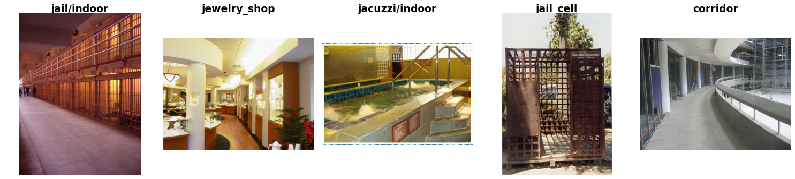

SUN-397
=======

.. raw:: html

   

   
   
   
   

Overview
--------

SUN-397 is a scene recognition dataset introduced as part of the Scene UNderstanding (SUN) database to advance
research in scene categorization. While existing scene recognition datasets covered a relatively limited range
of categories, the SUN database was designed to capture a broader variety of real-world environments. The full
database contains 899 scene categories and 130,519 images. SUN-397 is the 397-category subset used to benchmark
scene recognition algorithms in the original paper.

SUN-397 contains **108,754 images across 397 scene categories, with at least 100 images per category**. The original
dataset provides ten predefined train/test partitions, each containing 50 training images and 50 testing images
per class. All ten partitions are included in this implementation to support reproducible evaluation. An
additional `all` configuration provides all available images as a single training split for self-supervised
learning (SSL) pipelines that do not require predefined train/test partitions.

The original download link provided on the official SUN dataset website is no longer functional. Therefore, a
third-party upload on huggingface was used to obtain the dataset. The downloaded archive's MD5 checksum was
compared against the original checksum published on the official website, and the values matched, indicating that
the archive matches the original distribution.

All images are provided for research purposes only.

Data Structure
--------------

When accessing an example using ``ds[i]``, you will receive a dictionary with the following keys:

.. list-table::
   :header-rows: 1
   :widths: 20 20 60

   * - Key
     - Type
     - Description
   * - ``image``
     - ``PIL.Image.Image``
     - RGB image with maximum side length ≤ 11,500 pixels
   * - ``label``
     - int
     - Class label in the range ``[0, 396]``

Usage Example
-------------

**Basic Usage**

.. code-block:: python

    from stable_datasets.images.sun397 import SUN397

    # Load the full dataset (only has training split)
    ds = SUN397(split="train")

    # Load the first dataset partition
    part = SUN397("partition_01")
    print(part.keys())  # {"train", "test"}

    sample = ds[0]
    print(sample.keys())  # {"image", "label"}

    # Optional: make it PyTorch-friendly
    ds_torch = ds.with_format("torch")

References
----------

- Official website: https://3dvision.princeton.edu/projects/2010/SUN/
- License: Non-commercial research use

Citation
--------

.. code-block:: bibtex

    @inproceedings{5539970,
        title     = {SUN database: Large-scale scene recognition from abbey to zoo},
        author    = {Xiao, Jianxiong and Hays, James and Ehinger, Krista A. and Oliva, Aude and Torralba, Antonio},
        year      = {2010},
        booktitle = {2010 IEEE Computer Society Conference on Computer Vision and Pattern Recognition},
        volume    = {},
        number    = {},
        pages     = {3485--3492},
        doi       = {10.1109/CVPR.2010.5539970}
    }
